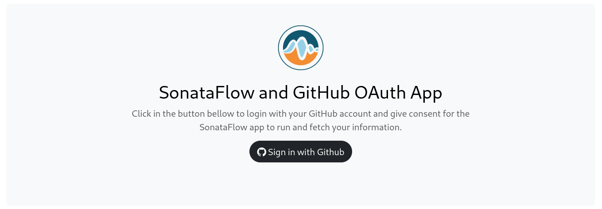
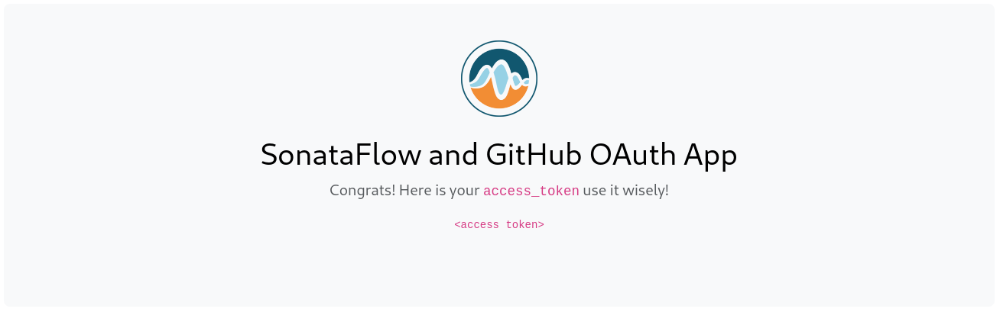

# Reproducer workflow
The workflow is retreiving the files to be pushed to a github branch and creates a PR; MockServer_light.py returns only few files.

To authenticate against Github, an access token must be provided. The access token must be granting permissions to
* create and push new branchs
* commit and push changes
* create pull requests

In RHDH (PROD), the access token will be given in the `Authorization` header using the token generated when the user logged in using the GitHub provider. 
> [!NOTE]
> This feature is still under develompment

WHen developing the workflow or when testing it locally, you may want to generate the access token and pass it in the execution request header. For that pupose, follow the `DEV` sections. 

## Setup for DEV

1. Create an account in [ngrok](https://ngrok.com/docs/getting-started/) and a new custom domain to facilitate your configuration later. This is required for GitHub OAuth flow to call back your local application.
2. Create a [new GitHub OAuth App](https://docs.github.com/en/apps/oauth-apps/building-oauth-apps/creating-an-oauth-app) and take notes of your `client_secret` and `client_id`. Use the custom domain you created in the first step as the URLs for your app. The callback URL is `https://your.domain.ngrok-free.app/callback`.
3. Create an `.env` file in the root of your `get-consent-web` project with the values `POC_SF_GH_CLIENT_ID` and `POC_SF_GH_CLIENT_SECRET` for your GitHub's client ID and Secret respectively. The web app will use this info to connect to GitHub servers.

By default, the access token has the scope set to `repo`. You can update this by changing the value `org.acme.poc.sonataflow.consent.web.github.scope` defined in [the application.proporties file](get-consent-web/src/main/resources/application.properties)
## Running the Example

1. Start the workflow application

```shell
cd reproducer
mvn clean quarkus:dev
```


2. Start the Mock server.
```shell
python MockServer_light.py
```

### In DEV mode

For development/testing puposes, the following section guide you to retreive an access token from Github OAuth App and then use it when calling the workflow.

1. Start ngrok in a separate terminal.

```shell
ngrok http http://localhost:9090 --url https://<your domain>.ngrok-free.app
```

2. In a new terminal start the web application to get the GitHub access token.

```shell
cd get-consent-web
mvn clean quarkus:dev
```

3. Go to https://<your domain>.ngrok-free.app and sign-in with github


4. Upon, succesfful login, you will be redirected to the /callback endpoint which will provide you with the access_token. 


5. The above token must be set in the header of the execution request header. In DEV mode, the expected header is `X-GitHub-Authorization`. In PROD mode, it should be `Authorization` but you can set the excpted header name by updating the [application.properties](reproducer/src/main/resources/application.properties) file.
```shell
curl -XPOST -H "Content-type: application/json" -H "X-GitHub-Authorization: ${ACCESS_TOKEN}" http://localhost:8080/basic -d '{
   "workflowdata":{
      "owner":"replaceMe",
      "repo":"replaceMe",
      "baseBranch":"replaceMe",
      "targetBranch":"replaceMe"
   }
}'
```